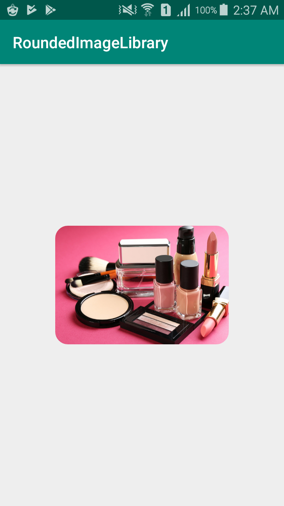

# RoundedImageView

[](https://github.com/dipkastel/RoundedImageView)
[](https://developer.android.com/index.html)
<a target="_blank" href="https://android-arsenal.com/api?level=14"></a>
[](https://github.com/KotlinBy/awesome-kotlin)
[](https://jitpack.io/#dipkastel/RoundedImageView)

simple library to round images simple fastest way to round images



## Contribute

* Please file an [issue](https://github.com/dipkastel/RoundedImageView/issues) or [pull request](https://github.com/dipkastel/RoundedImageView/pulls) 

## Gradle


Step 1. Add it in your root build.gradle at the end of repositories:

```
	allprojects {
		repositories {
			...
			maven { url 'https://jitpack.io' }
		}
	}
```
Step 2. Add the dependency

```
	dependencies {
	        implementation 'com.github.dipkastel:RoundedImageView:1.0.1'
	}
```

## Maven
Step 1. Add the JitPack repository to your build file

```
	<repositories>
		<repository>
		    <id>jitpack.io</id>
		    <url>https://jitpack.io</url>
		</repository>
	</repositories>
```
Step 2. Add the dependency
```
	<dependency>
	    <groupId>com.github.dipkastel</groupId>
	    <artifactId>RoundedImageView</artifactId>
	    <version>Tag</version>
	</dependency>
```


## Usage

Use the `RoundedImageView` as imageView in xml files. 

Here are some examples:

Code:

```xml
<com.notrika.roundedimagelibrary.RoundedImageView
    android:layout_width="220dp"
    android:layout_height="150dp"
    android:layout_centerInParent="true"
    android:scaleType="centerCrop"
    android:src="@drawable/cosmetics_lawyers_in_vietnam_1"
    app:cornerRadus="16dp"
    />
```
